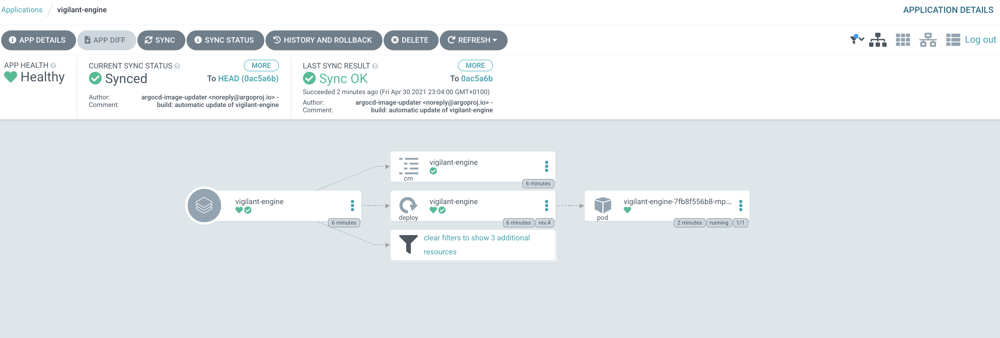

# vigilant-engine

Google Domains Dynamic DNS updater


## Build and deploy

Build setup is for multiarch support, a requirements for this is  [buildx](https://docs.docker.com/buildx/working-with-buildx/)

For `skaffold` integration i followed the suggestion [here](https://github.com/GoogleContainerTools/skaffold/tree/master/examples/custom-buildx) as ther eis no direct integration between `skaffold` and `buildx`


Images are pushed to `ghcr.io/shipperizer/vigilant-engine`, `k3s` cluster has a secret allowing it to pull them, see the snippet below in `deployments.yaml`

```
containers:
- image: ghcr.io/shipperizer/vigilant-engine
  name: vigilant-engine
  envFrom:
    - configMapRef:
        name: vigilant-engine
  name: vigilant-engine
imagePullSecrets:
- name: regcred-github
```

To work it needs a secret, not defined in the repo, it follows the following format

```
apiVersion: v1
kind: Secret
metadata:
  name: vigilant-engine
data:
  USERNAME: abcdefghi==
  PASSWORD: abcdefghi==
  DNS_RECORD: abcdefghi==
```

### Kaniko

For `kaniko` builds, use the `--profile kaniko` modifier on `skaffold`, for this you will need an `Opaque` secret:

```
 echo '{"auths":{"ghcr.io":{"auth":"****************"}}}' | kubectl create secret generic regcred-github-kaniko --from-file=config.json=/dev/stdin
 ```

the profile is targeted at building on an `arm64` cluster only, if you need to use a different arch change `initImage` and `image` values

## ArgoCD

ArgoCD is used (together with ArgoCD image updater) to keep application up-to-date

see the `argocd.yaml` for extra informations
local setup will be described eventually in here, step by step


